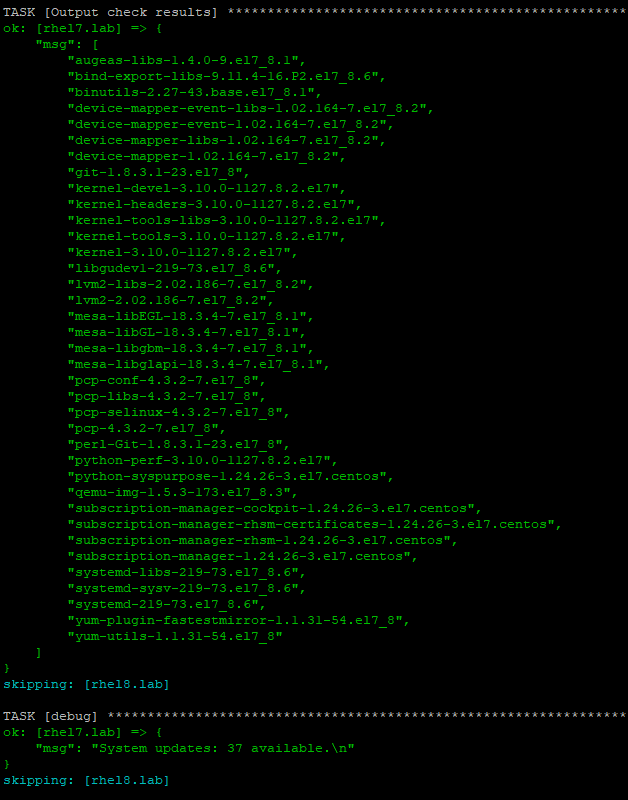

# Update CentOS/RHEL

Copyright (C) 2019 Dmitriy Prigoda <deamon.none@gmail.com> 
This script is free software: Everyone is permitted to copy and distribute verbatim copies of 
the GNU General Public License as published by the Free Software Foundation, either version 3
of the License, but changing it is not allowed.

Протестировано на:
- CentOS 8 
- Ansible = 2.9.5

Установка обновлений CentOS/RHEL с помощью Ansible
--------------------------------------------------

### Содержание
1. [Запуск Playbook'а](#запуск-playbookа)
2. [Дополнительные переменные](#дополнительные-переменные)
3. [Теги](#теги)
4. [Documentations ANSIBLE](#documentations-ansible)

Основная разработка ведется по адресу:

  * https://github.com/D34m0nN0n3/ansible-update-os/

По данной ссылке находится последняя версия, для получения доступа необходимо связаться с автором.

Чтобы скачать последнюю версию необходимо выполнить команду на клиенте с которого будет запущен данный playbook:

```
> cd ~
> git clone https://github.com/D34m0nN0n3/ansible-update-os.git
```
### Запуск Playbook'а
Для запуска данного сценария необходимо:
1. Убедится что есть сетевой доступ с управляющего сервера до управляемых узлов по 22 порту (ssh). Подробно описано в документации: `Connection methods` и `Ansible passing sudo`. 
2. В наличии учетной записи с правами администратора из под которой будет производится подключение.
3. Заполненный файл `inventory` с перечисленными управляемыми узлами и переменными. *Пример файла: [inventory/hosts.example](inventory/hosts.example)*

Пример запуска с указанием пароля пользователя под которым подключаемся к управляемым хостам:
```
bash
# Go to the project folder:
> cd ~/ansible-update-os
# Run playbook:
> ansible-playbook -i inventory/hosts playbook.yml --ask-pass --become --ask-become-pass
```
##### Ключи
Key                 |INFO
--------------------|------------------------------------------------------------------
-i                  |Необходимо указать путь к файлу `inventory`
-v or -vv           |Повышает информативность вывода, нужен для анализа ошибок
--become            |Предоставляет повышение полномочий через `sudo` УЗ при подключение
--ask-pass          |Запрашивает пароль УЗ под которой будет выполнен сценарий
--ask-become-pass   |Запрашивает пароль УЗ при запуске `sudo`

*При запуске и в момент исполнения формируется файл с логами для анализа ошибок [logs/ansible-log.log](logs/ansible-log.log). Размер файла зависит от уровня подробного вызова и количества запусков сценария.*

### Дополнительные переменные
Переменные учета ресурсов (inventory variables) - это те переменные, которые Ansible получает посредством определенной инвентаризации. Они могут быть определены как переменные, которые являются особыми для `host_vars` по отношению к индивидуальным хостам или применяться к целой группе как `group_vars`. Эти переменные могут записываться напрямую в имеющийся файл описи, доставляться определенными динамическими встраиваемыми модулями инвентаризации или загружаться из каталогов `host_vars/<host>` или `group_vars/<group>`.
Для данного проекта зарезервированы следующие переменные приведенные в таблице ниже:

Var           |INFO
--------------|------------------------------------------------------------------------------------
show_updates  |Выводит список доступных обновлений. *Значение Булево*.
exclude       |Список исключений, записывается как массив разделенный запятыми. *Значения строчные*.
security      |ЭКСПЕРИМЕНТАЛЬНЫЙ! Установка только обновлений безопасности. *Значение Булево*.
need_reboot   |Перезагрузка желательна, но не обязательна. *Значение Булево*.
force_reboot  |Перезагрузка обязательна. *Значение Булево*.

Пример отображения списка доступных обновлений:


Пример отображения информации о времени перезагрузки:


### Теги
Теги нужны для того, чтобы иметь возможность исполнить только какую-то часть плейбука или ее пропустить для выполнения.

Tag           |INFO
--------------|--------------------------------------
check_update  |Проверка наличия доступных обновлений.
updates       |Установка обновлений.
reboot        |Перезагрузка системы.

## Documentations ANSIBLE:
- [Ansible installation guide](https://docs.ansible.com/ansible/latest/installation_guide/intro_installation.html)
- [Ansible Documentations](https://docs.ansible.com/)
- [Ansible tags](https://docs.ansible.com/ansible/latest/user_guide/playbooks_tags.html)
- [Connection methods](https://docs.ansible.com/ansible/latest/user_guide/connection_details.html)
- [Ansible passing sudo](https://8gwifi.org/docs/ansible-sudo-ssh-password.jsp)
- [Manages packages with the yum package manager](https://docs.ansible.com/ansible/latest/modules/yum_module.html)
